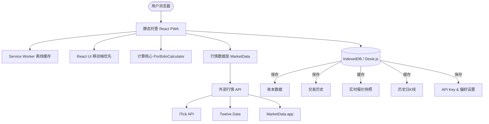
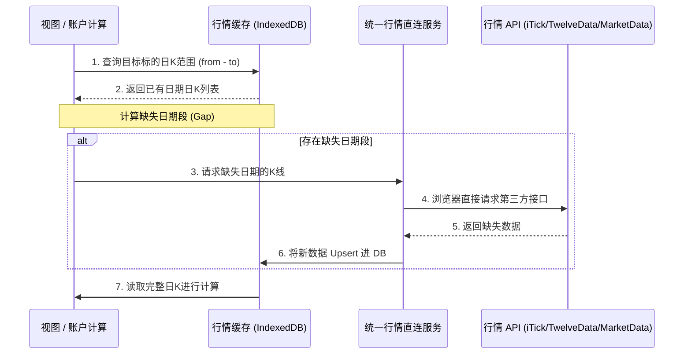

# Recoder Web PWA 架构说明书 (ARCHITECTURE)

本项目是将原 Android 股票记账 APP (`recoder`) 迁移为纯前端、本地优先（Local-First）的 PWA Web 应用。应用在保证完全免费、无需注册登录的前提下，将所有账目数据与敏感配置保留在用户本地浏览器中。

---

## 一、 系统架构概述

系统遵循 **No-Backend (无后端)** 与 **Local-First (本地优先)** 的设计理念。



### 1. 核心架构特点
- **纯前端静态托管**：可免费部署在 GitHub Pages、Vercel 或 Cloudflare Pages 等静态托管平台。第一版不设任何 Node.js 后端、API 中转或云端数据库。
- **本地优先存储**：使用浏览器原生 **IndexedDB** 存储用户所有交易数据、设置以及行情缓存。使用 **Dexie.js** 作为 ORM 包裹层以提供稳健的查询与事务支持。
- **行情直连与缓存**：由用户自行配置第三方行情平台的 API Key（iTick、TwelveData、MarketData.app）。浏览器端直接请求相应 API，获取的最新报价（Quote）与历史日K（Historical Daily Bar）均持久化缓存于 IndexedDB 中。
- **离线可用 (PWA)**：注册 Service Worker 实现静态资源（HTML/JS/CSS/字体/图标）的本地缓存。即使在无网络环境下，用户也能正常打开应用并录入、查阅本地账目。
- **Android 备份兼容**：无缝读取 Android 原项目的备份 JSON，且导出的备份 JSON 格式保持一致，确保双端数据能自由迁移。

---

## 二、 数据存储设计 (IndexedDB Schema)

使用 Dexie.js 定义本地数据库。默认版本为 `1`。

### 1. 数据库表定义

#### `ledgers` (账本表)
- **作用**：记录不同账本。第一版仅在首次使用时初始化并使用单个默认个人账本，但底层保留多账本设计。
- **主键**：`id` (自增 Long)
- **索引**：`id`, `name`
- **字段**：
  - `id: number`
  - `name: string` (如 "默认个人账本")
  - `type: 'PERSONAL' | 'JOINT'` (个人/合资)
  - `description: string`
  - `partners: string` (合伙人名单，逗号分隔，如 "我,Alice")
  - `createdAt: number`
  - `updatedAt: number`

#### `transactions` (交易历史表)
- **作用**：存储所有手动录入的交易。
- **主键**：`id` (自增 Long)
- **索引**：`id`, `ledgerId`, `tradeDate`, `symbol`, `market`, `platform`, `[ledgerId+tradeDate]`, `[market+symbol]`
- **字段**：
  - `id: number`
  - `ledgerId: number` (外键，默认 `1`)
  - `tradeType: string` (枚举：`BUY`, `SELL`, `DEPOSIT`, `WITHDRAW`, `TRANSFER_IN`, `TRANSFER_OUT` 等)
  - `platform: string` (券商平台，如 `LONGBRIDGE`, `ZHUORUI`, `SCHWAB` 等)
  - `sourceChannel: string | null` (导入来源渠道，第一版手动录入为 `null`)
  - `externalReference: string | null` (外部关联 ID)
  - `market: string` (市场：`A_SHARE`, `HK`, `US`, `CASH`)
  - `symbol: string` (标的代码，如 `00700` 或 `AAPL`)
  - `name: string` (标的名称，如 `腾讯控股` 或 `苹果公司`)
  - `tradeDate: string` (交易日期 `YYYY-MM-DD`)
  - `tradeTime: string` (交易时间 `HH:mm:ss`)
  - `price: number`
  - `quantity: number`
  - `commission: number` (佣金)
  - `tax: number` (印花税/规费)
  - `note: string` (备注)
  - `createdAt: number`
  - `updatedAt: number`
  - `investorName: string | null` (投资人姓名)
  - **期权扩展字段**：
    - `assetType: 'STOCK' | 'OPTION'` (资产类型)
    - `underlyingSymbol: string | null` (期权标的资产)
    - `expiryDate: string | null` (期权到期日 `YYYY-MM-DD`)
    - `strikePrice: number | null` (行权价)
    - `optionType: 'CALL' | 'PUT' | null` (期权类型)
  - **汇率转换字段**：
    - `fxFromCurrency: string | null` (兑换前币种)
    - `fxFromAmount: number | null` (兑换前金额)
    - `fxToCurrency: string | null` (兑换后币种)
    - `fxToAmount: number | null` (兑换后金额)
    - `fxRate: number | null` (兑换汇率)

#### `quoteSnapshots` (实时报价快照表)
- **作用**：缓存证券的最近一次行情，持仓首页及资产总值优先读取此处。
- **主键**：`id` (自增或 symbol+market 拼接字符串)
- **索引**：`id`, `symbol`, `market`, `[market+symbol]`
- **字段**：
  - `symbol: string`
  - `market: string`
  - `name: string`
  - `assetType: string`
  - `currentPrice: number | null`
  - `previousClose: number | null`
  - `change: number | null`
  - `changePercent: number | null`
  - `currency: string`
  - `provider: string` (行情来源，如 `itick`, `twelvedata`)
  - `fetchedAt: number`

#### `historicalDailyBars` (历史日K线缓存表)
- **作用**：缓存标的历史价格点，用于绘制资产累计曲线、分析图表及历史盈亏计算。**唯一主键逻辑为 `symbol + market + assetType + date`**。
- **主键**：自动生成或拼接唯一键
- **索引**：`id`, `symbol`, `market`, `date`, `[market+symbol+date]`, `[symbol+market+assetType+date]`
- **字段**：
  - `symbol: string`
  - `market: string`
  - `assetType: string`
  - `date: string` (日期 `YYYY-MM-DD`)
  - `open: number | null`
  - `high: number | null`
  - `low: number | null`
  - `close: number`
  - `volume: number | null`
  - `provider: string`
  - `fetchedAt: number`

#### `marketProviderConfigs` (行情源配置表)
- **作用**：存储用户配置的行情平台 API 秘钥及选项，确保秘钥只保存在本地 IndexedDB 中。
- **主键**：`id` (如字符串或自增)
- **索引**：`id`, `provider`, `enabled`, `priority`
- **字段**：
  - `provider: 'itick' | 'twelvedata' | 'marketdata'`
  - `enabled: boolean` (是否启用)
  - `priority: number` (优先级，数值越小越优先)
  - `apiKey: string`
  - `baseUrl: string`
  - `optionsJson: string` (其他 JSON 格式 of 扩展配置)
  - `createdAt: number`
  - `updatedAt: number`

#### `appSettings` (应用设置表)
- **作用**：存储通用的 UI 偏好及全局状态。
- **主键**：`key` (如 `"default_ledger"`, `"persistent_storage_requested"`)
- **字段**：
  - `key: string`
  - `value: any`
  - `updatedAt: number`

#### `backupImportRecords` (备份导入历史表)
- **作用**：记录本地备份文件的导入历史。
- **字段**：
  - `id: number`
  - `fileName: string`
  - `importedAt: number`
  - `transactionCount: number`
  - `ledgerCount: number`
  - `dateRangeStart: string`
  - `dateRangeEnd: string`
  - `status: 'SUCCESS' | 'FAILED'`
  - `message: string`

---

## 三、 行情数据层设计 (Market Data Service)



### 1. 统一提供商接口 (`MarketDataProvider`)
所有的行情提供商（iTick, TwelveData, MarketData.app）都将实现一个通用的 TS 接口：
```typescript
export interface MarketDataProvider {
  id: string;
  label: string;
  searchSecurities(keyword: string, market: string): Promise<SecuritySearchResult[]>;
  getRealtimeQuotes(requests: QuoteRequest[], apiKey: string): Promise<QuoteSnapshot[]>;
  getHistoricalDailyBars(requests: DailyBarRequest[], apiKey: string): Promise<HistoricalDailyBar[]>;
}
```

### 2. 本地缓存与缺失段请求算法 (`MarketDataCacheService`)
为了最大限度节约用户 API 额度，查询历史价格时必须：
1. 从本地 `historicalDailyBars` 中提取该标的所有在 `[from, to]` 时间段内的缓存记录。
2. 识别缺失的日期区间（如由于周末、节假日或未请求过）。
3. 仅向直连 API 发送缺失日期的请求。
4. 返回后将最新数据 upsert 至 IndexedDB 中。
5. 同一标的同一天仅保留一条日K。

---

## 四、 核心资产计算逻辑 (PortfolioCalculator)

资产及盈亏计算核心是完全独立于前端 UI 库（React）与数据库（IndexedDB）的纯函数计算模块。其输入与输出对齐原 Android 版本的 `PortfolioCalculator.kt`：

### 1. 计算核心输入
- `transactions: TransactionUiModel[]` (本地所有或已筛选的交易明细)
- `quotes: QuoteSnapshot[]` (当前实时报价缓存)
- `exchangeRates: ExchangeRates` (当前汇率)

### 2. 计算核心处理流
- 对交易历史按“**有效交易日期 -> 交易时间 -> 创建时间**”进行升序排序。
  > **注意：** 美股在早上 6:00 前的交易（即美股夏/冬令时夏夜交易段），其有效日期应自动减 1 天以对齐交易日逻辑（遵循 Android `PortfolioSecurityRules.kt` 规则）。
- 逐步迭代交易明细，计算每个标的的持有数量、平均买入成本、剩余总成本、已实现盈亏：
  - **买入 (BUY)**：计算是否为做空持仓平仓，或是直接建仓。
  - **卖出 (SELL)**：计算平仓盈亏，支持部分卖出与分批买入后的均价平仓计算。
  - **入金/出金 (DEPOSIT/WITHDRAW)**：仅影响现金余额与累计出入金。
  - **分红/税费 (DIVIDEND/TAX)**：直接影响现金余额及个股已实现盈亏。
  - **拆并股 (SPLIT)**：根据拆股比例调整持有数量及持仓均价。
  - **期权到期 (EXPIRE)**：对持有期权进行清零并结算为已实现盈亏。
- 使用最新 `quotes` 计算持仓的当前市值与未实现盈亏。
- 输出完整的 `PortfolioSnapshot` / `HoldingUiModel` 汇总给页面渲染。

---

## 五、 PWA 与本地持久化

### 1. 离线缓存
通过 Vite PWA 插件（如 `vite-plugin-pwa`），在构建时自动生成 `registerServiceWorker.ts`。
- 缓存策略：静态资源（JS/CSS/HTML）使用 **CacheFirst**；行情 API 使用直连网络，失败后降级读取 IndexedDB 缓存。

### 2. 存储持久化 (Storage Persistence)
Web 浏览器在磁盘空间不足时可能自动清理 IndexedDB。为了降低数据丢失风险：
- 在首次录入交易后，程序触发 `navigator.storage.persist()` 请求持久化存储权限。
- 在“设置”及“备份”页面中，调用 `navigator.storage.estimate()` 与 `navigator.storage.persisted()`，实时展示已使用空间、配额以及持久化授权状态。

---

## 六、 安全、隐私与合规

1. **绝对隐私**：交易数据仅保留在浏览器沙箱（IndexedDB）内，绝不上传到任何服务器或云端。
2. **API 秘钥安全**：
   - 不得内置公共 API Key，严防高额账单与 CORS 被盗用。
   - 不允许通过 `VITE_*` 等前端环境变量硬编码暴露敏感 API Key。
   - 用户的 API Key 完全由其手动填入，并保存在本地 IndexedDB 中。
   - 默认导出备份 JSON 时，**不包含** API Key 等敏感配置。
3. **备份提醒**：由于本地浏览器清理站点数据或隐私模式会清空 IndexedDB，系统须在设置页醒目提示该风险，并根据 `appSettings` 中的 `lastBackupTime` 提醒用户定期手动备份。
